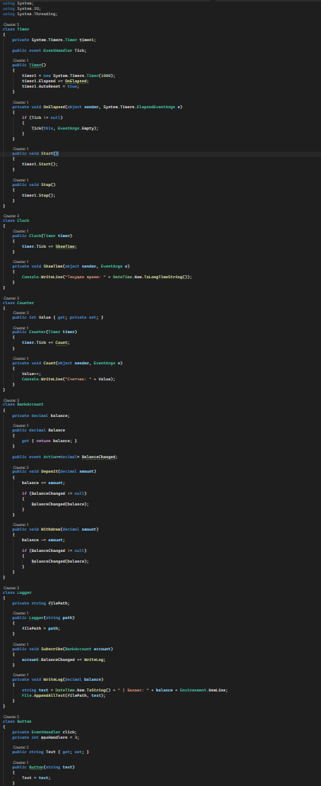
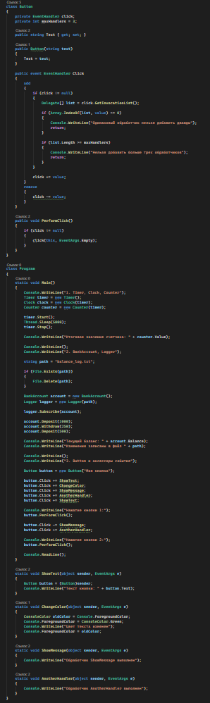
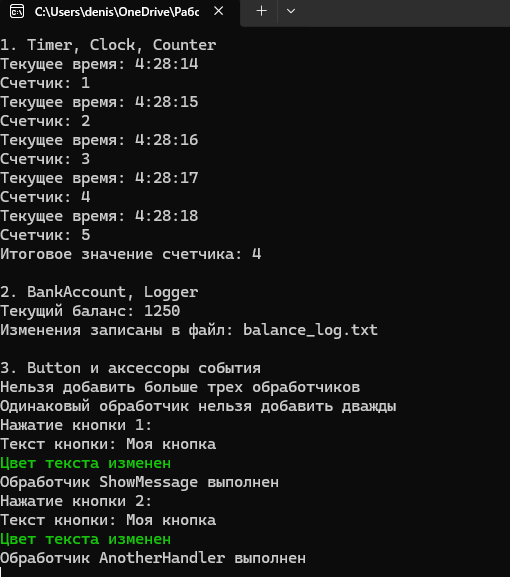

# C# KT8

1. Напишите класс Timer, который имеет событие типа EventHandler с именем Tick, которое возникает каждую секунду. Затем напишите класс Clock, который подписывается на это событие и выводит на консоль текущее время при каждом его возникновении. Затем напишите класс Counter, который также подписывается на это событие и увеличивает свое значение на единицу при каждом его возникновении. Продемонстрируйте работу этих классов в методе Main.

2. Напишите класс BankAccount, который имеет свойство Balance типа decimal и событие типа Action<decimal> с именем BalanceChanged, которое возникает при изменении баланса. Затем напишите методы Deposit(decimal amount) и Withdraw(decimal amount), которые изменяют баланс на заданную сумму и вызывают событие BalanceChanged. Затем напишите класс Logger, который подписывается на это событие и записывает в файл все изменения баланса. Продемонстрируйте работу этих классов в методе Main.

3. Напишите класс Button, который имеет свойство Text типа string и событие типа EventHandler с именем Click, которое возникает при нажатии на кнопку. Затем напишите аксессоры для этого события: add и remove, которые контролируют, сколько подписчиков может иметь это событие. Например, вы можете ограничить максимальное количество подписчиков до трех или запретить добавлять один и тот же подписчик дважды. Затем напишите несколько методов, которые могут быть подписаны на это событие, например, выводящие на консоль текст кнопки или меняющие его цвет. Продемонстрируйте работу этих методов в методе Main.

### Код

### Результат

